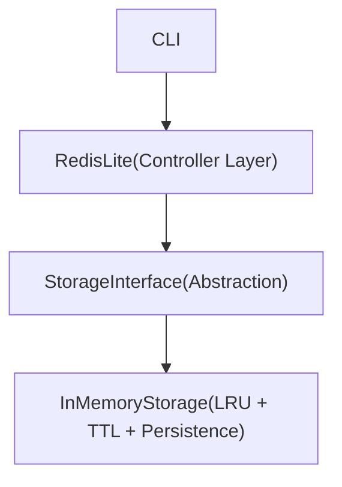
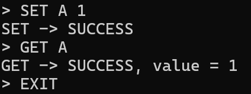
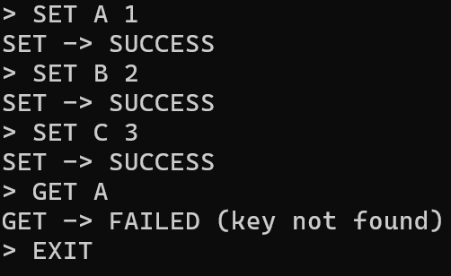
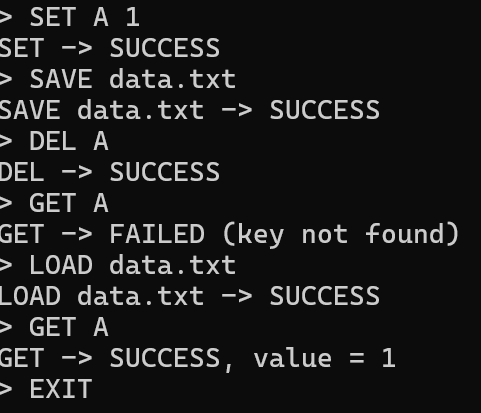
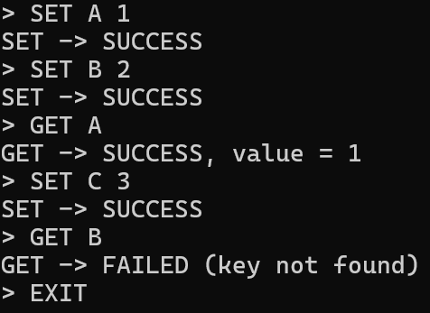

# Mini-Redis — In-Memory Key-Value Store (C++)

A Redis-inspired **in-memory key-value cache** implemented in **C++**, focusing on **clean object-oriented design**, **O(1) operations**, and **real-world cache eviction semantics** such as **LRU** and **TTL (lazy expiration)**.

This project is intentionally designed as a **systems-level learning project**, emphasizing correctness, performance trade-offs, and clean layering rather than feature bloat.

---

## 🚀 Features

- O(1) **SET, GET, DEL, EXISTS**
- **LRU (Least Recently Used)** eviction policy
- **TTL (Time-To-Live)** with lazy expiration
- **TTL eviction has priority over LRU eviction**
- Clean layered architecture
- Persistence via **SAVE / LOAD**
- No background threads
- Iterator-safe, production-style cache logic

---

## 🏗️ Architecture Overview

The system follows strict separation of concerns:
## Architecture Flow



### Design Rationale

- CLI handles only user interaction
- Controller validates commands
- Storage layer owns all cache semantics (LRU, TTL, eviction)
- Eviction logic is fully encapsulated inside storage

This mirrors real-world system design used in production caches.

---

## 🧠 Data Structures Used

| Purpose | Data Structure |
|------|---------------|
| Key lookup | `unordered_map<string, CacheEntry>` |
| LRU ordering | `std::list<string>` |
| O(1) LRU updates | `list<string>::iterator` stored in entry |

### Why this works

- Hash map provides O(1) access
- Doubly-linked list maintains usage order
- Iterators allow constant-time LRU updates

This is the industry-standard LRU cache implementation approach.

---

## 🔄 LRU Eviction Strategy

- **Most Recently Used (MRU)** keys are stored at the front of the list
- **Least Recently Used (LRU)** keys are stored at the back of the list

### Rules

- `GET` refreshes LRU position
- `SET` on existing key refreshes LRU
- `SET` on new key evicts LRU if capacity is full
- `EXISTS` does **not** affect LRU order

All operations run in **O(1)** time.

---

## ⏳ TTL (Time-To-Live) Design

### Overview

TTL defines how long a key remains valid before it becomes **expired**.

### Key Design Decisions

- TTL is optional per key
- TTL is implemented using **lazy expiration**
- No background cleanup thread is used
- Expired keys behave exactly like deleted keys
- **TTL eviction always has priority over LRU eviction**

### Lazy Expiration Explained

Expired keys are removed only when accessed via:
- `GET`
- `EXISTS`
- `SET`
- eviction checks

This keeps all operations O(1) and avoids unnecessary background work.

> TTL logic is implemented at the **storage engine level**.  
> The CLI currently defaults to non-expiring keys, but the design cleanly supports future commands such as `SETEX` or `EXPIRE`.

---

## 💾 Persistence (SAVE / LOAD)

- `SAVE filename`
  - Writes the entire in-memory state to disk
  - Format: `key=value`
- `LOAD filename`
  - Clears existing data
  - Reloads keys as **non-expiring**
  - Rebuilds LRU state safely

### Design Choice

TTL metadata is **not persisted**.  
After loading, all keys are treated as non-expiring.

This avoids restoring stale expiration state and keeps persistence predictable.

---

## 🧪 Test Scenarios

### Basic Operations
```bash
SET A 1
GET A → 1
```
### LRU Eviction (capacity = 2)
```text
SET A 1
SET B 2
SET C 3
GET A → NOT FOUND
```
### LRU Refresh
```text
SET A 1
SET B 2
GET A
SET C 3
GET B → NOT FOUND
```
### TTL Expiration (engine-level)
```text
SET A 1
(wait for expiry)
GET A → NOT FOUND
```
### TTL > LRU Priority
```text
SET A 1 (expired)
SET B 2
SET C 3
→ A removed, B survives
```
### Persistence
```text
SET A 1
SAVE data.txt
DEL A
LOAD data.txt
GET A → 1
```

---

## ⏱️ Time & Space Complexity

| Operation | Complexity |
|--------|-----------|
| SET | O(1) |
| GET | O(1) |
| DEL | O(1) |
| EXISTS | O(1) |

Space complexity is **O(N)** where N is the number of keys stored.

---

## ⚠️ Limitations & Future Improvements

- TTL is not yet exposed via CLI commands
- No concurrency support
- No networking or Redis protocol support
- Persistence is snapshot-based (no WAL/AOF)

These are intentional trade-offs to keep the focus on core cache correctness.

---

## 🛠️ Build & Run

```bash
g++ main.cpp InMemoryStorage.cpp RedisLite.cpp -o mini_redis
mini_redis
```
## 📸 Screenshots

> Screenshots demonstrate CLI usage and cache behavior.  
> TTL behavior is implemented internally using lazy expiration and is explained in the design section.

### Basic SET / GET
Shows successful insertion and retrieval of a key.
<p align="left">
  
</p>

---

### LRU Eviction
Demonstrates eviction of the least recently used key when capacity is exceeded.
<p align="left">
  
</p>

---

### LRU Refresh Behavior
Accessing a key updates its recency and affects eviction order.
<p align="left">
  
</p>

---

### Persistence (SAVE / LOAD)
Verifies snapshot persistence and correct restoration of cache state.
<p align="left">
  
</p>


## 👤 Author

**Madhav**  
_B.Tech ICT | Systems & Backend Enthusiast_


