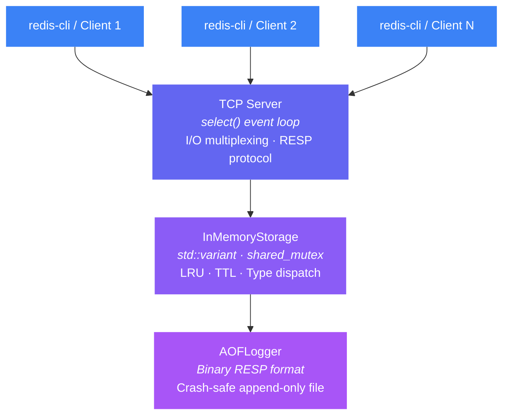
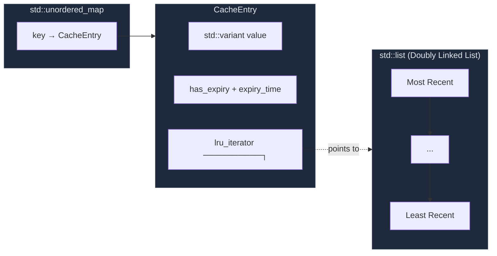

# Mini-Redis — High-Performance In-Memory Cache Engine in C++

A production-grade **Redis clone** built from scratch in **C++17** — featuring a **TCP server with RESP protocol**, **I/O multiplexing via `select()`**, **AOF crash-safe persistence**, **4 data types**, **O(1) LRU eviction**, **lazy TTL expiration**, and **reader-writer thread safety**.

Achieves **~20,000 ops/sec** (24% of production Redis) on a single thread with crash-safe writes.

---

## Benchmark Results

Tested with official `redis-benchmark` on Windows (localhost, same machine).

### Throughput (requests/second)

| Command | Mini-Redis | Real Redis 7.x | Ratio |
|---------|:----------:|:--------------:|:-----:|
| **SET** | 19,486 | 81,699 | 24% |
| **GET** | 20,296 | 85,837 | 24% |
| **LPUSH** | 22,041 | — | — |
| **LPOP** | 22,401 | — | — |
| **SADD** | 24,431 | — | — |

### Latency (single client, 10k requests)

| Command | p99 Latency | Throughput |
|---------|:-----------:|:----------:|
| **SET** | ≤ 1ms | 18,315 req/s |
| **GET** | < 1ms | 32,154 req/s |

### Why 4x slower than Redis? (Interview-ready answer)

| Design Choice | Cost | Why We Made It |
|---|---|---|
| `flush()` on every write | ~50% of gap | **Crash safety** — zero data loss on power failure |
| `std::unordered_map` + `std::string` | Memory copies | **Type safety** via `std::variant`, clean C++ |
| `std::shared_mutex` | Lock overhead | **Thread safety** for concurrent access |
| RESP parsing with `string::erase()` | O(n) copies | **Simplicity** over micro-optimization |

What Real Redis uses instead: `jemalloc` (custom allocator), `sds` (zero-copy strings), configurable `fsync` policy, 30+ years of C optimization.

---

## Architecture


```mermaid
flowchart TD
    Client1["redis-cli / Client 1"]
    Client2["redis-cli / Client 2"]
    Client3["redis-cli / Client N"]

    Server["TCP Server\n<i>select() event loop</i>\nI/O multiplexing · RESP protocol"]
    Storage["InMemoryStorage\n<i>std::variant · shared_mutex</i>\nLRU · TTL · Type dispatch"]
    AOF["AOFLogger\n<i>Binary RESP format</i>\nCrash-safe append-only file"]

    Client1 --> Server
    Client2 --> Server
    Client3 --> Server
    Server --> Storage
    Storage --> AOF

    style Client1 fill:#3b82f6,color:#fff,stroke:none
    style Client2 fill:#3b82f6,color:#fff,stroke:none
    style Client3 fill:#3b82f6,color:#fff,stroke:none
    style Server fill:#6366f1,color:#fff,stroke:none
    style Storage fill:#8b5cf6,color:#fff,stroke:none
    style AOF fill:#a855f7,color:#fff,stroke:none
```

**Single-threaded event loop** (same as real Redis) — `select()` monitors all sockets. No threads, no locks needed in the server layer. One thread handles hundreds of concurrent clients.

### Layered Design

| Layer | File(s) | Responsibility |
|-------|---------|----------------|
| **Network** | `Server.h/.cpp` | TCP accept, `select()` loop, RESP encode/decode |
| **Protocol** | `RespParser.h` | RESP parsing (binary-safe) + inline command support |
| **Controller** | `RedisLite.h/.cpp` | Input validation, command routing |
| **Engine** | `InMemoryStorage.h/.cpp` | LRU, TTL, type dispatch, AOF integration |
| **Persistence** | `AOFLogger.h` | Append-only file I/O in RESP format |
| **CLI** | `main.cpp` | Interactive command-line interface |

---

## Supported Data Types

| Type | Commands | Internal Structure |
|------|----------|-------------------|
| **String** | `SET`, `GET`, `SETEX` | `std::string` |
| **List** | `LPUSH`, `RPUSH`, `LPOP`, `RPOP`, `LRANGE`, `LLEN` | `std::deque<string>` |
| **Set** | `SADD`, `SREM`, `SMEMBERS`, `SISMEMBER`, `SCARD` | `std::unordered_set<string>` |
| **Hash** | `HSET`, `HGET`, `HDEL`, `HGETALL`, `HLEN` | `std::unordered_map<string,string>` |

All types are stored in a single `std::variant` — zero overhead, compile-time type safety, no virtual dispatch.

---

## Core Features

### 1. TCP Server with RESP Protocol

Full compatibility with `redis-cli` and `redis-benchmark`. Supports:
- **RESP arrays** (`*3\r\n$3\r\nSET\r\n...`) — binary-safe, length-prefixed
- **Inline commands** (`PING\r\n`) — for telnet/debugging
- **Per-client receive buffers** — handles TCP stream reassembly correctly

```bash
# Connect with redis-cli
redis-cli -p 6379
127.0.0.1:6379> SET name "hello world"
OK
127.0.0.1:6379> GET name
"hello world"
```

### 2. I/O Multiplexing (`select()`)

```
Before: accept() → handle client → BLOCKS → accept() next
After:  select() monitors ALL sockets → O(1) event dispatch
```

- Single thread handles concurrent clients without spawning threads
- Copy-before-iterate pattern prevents iterator invalidation
- 1-second timeout enables clean shutdown via Ctrl+C
- This is exactly how Redis works — single-threaded event loop

### 3. AOF Persistence (Crash-Safe)

Every write command is appended to `appendonly.aof` in **binary RESP format**:

```
Plain text:  "SET greeting hello world"     → BREAKS on replay (spaces)
RESP format: "*3\r\n$3\r\nSET\r\n$8\r\ngreeting\r\n$11\r\nhello world\r\n"
             ↑ length-prefixed → binary-safe ✓
```

| Feature | Details |
|---------|---------|
| Write safety | `flush()` after every command |
| Binary safety | RESP format — spaces, newlines, any byte in values |
| Replay on startup | `replayAOF()` rebuilds state from file |
| Compaction | `BGREWRITEAOF` rewrites with minimal commands |

### 4. O(1) LRU Eviction


```mermaid
graph LR
    subgraph HashMap["std::unordered_map"]
        A["key → CacheEntry"]
    end

    subgraph DLL["std::list (Doubly Linked List)"]
        MRU["Most Recent"] --> N2["..."] --> LRU["Least Recent"]
    end

    subgraph Entry["CacheEntry"]
        V["std::variant value"]
        E["has_expiry + expiry_time"]
        I["lru_iterator ──────────┐"]
    end

    A --> Entry
    I -.->|points to| DLL

    style HashMap fill:#1e293b,color:#e2e8f0,stroke:#334155
    style DLL fill:#1e293b,color:#e2e8f0,stroke:#334155
    style Entry fill:#1e293b,color:#e2e8f0,stroke:#334155
```

- HashMap for O(1) lookup + doubly-linked list for O(1) reordering
- Iterator stored in each entry — no linear scan to find position
- TTL-expired keys evicted first (priority over LRU)

### 5. Thread Safety

`std::shared_mutex` (reader-writer lock) — concurrent reads, exclusive writes.

| Method | Lock Type | Why |
|--------|-----------|-----|
| `GET`, `EXISTS` | `unique_lock` | Lazy expiration may trigger write |
| `SET`, `DEL`, `EXPIRE` | `unique_lock` | Modifies data |
| `TTL`, `TYPE`, `LRANGE` | `shared_lock` | Pure read |
| `SAVE` | `shared_lock` | Snapshot is read-only |

---

## Challenges Faced & Solutions

### Challenge 1: TCP Stream Reassembly

**Problem:** TCP doesn't preserve message boundaries. One `recv()` call might return half a command, or three commands concatenated together.

**Wrong approach:** Assume each `recv()` = one complete command. This works in testing but breaks under load.

**Solution:** Per-client receive buffer (`std::unordered_map<socket_t, string>`). Data is appended on each `recv()`. The parser extracts complete commands and leaves partial data in the buffer for the next `recv()`.

```cpp
// Process ALL complete commands, leave incomplete data for next recv()
while(!buffer.empty()) {
    auto [args, consumed] = RespParser::parse(buffer);
    if(consumed == 0) break;    // incomplete — wait for more data
    buffer.erase(0, consumed);
    executeCommand(args);
}
```

### Challenge 2: Binary Safety in Persistence

**Problem:** Values with spaces (`"hello world"`) break plain-text AOF parsing. `istringstream >> val` stops at the first space.

```
AOF line:   SET greeting hello world
Replay:     key="greeting", value="hello"  ← "world" is LOST
```

**Solution:** Switched AOF format from plain text to RESP (length-prefixed binary). `$11\r\nhello world\r\n` tells the parser "read exactly 11 bytes" — spaces are preserved.

### Challenge 3: Iterator Invalidation in select() Loop

**Problem:** When processing client data, a client might disconnect (QUIT or error). `removeClient()` erases from `client_buffers_` map. If we're iterating the map, this is undefined behavior.

**Solution:** Copy the client list before iterating:

```cpp
std::vector<socket_t> clients;
for(const auto& [client, _] : client_buffers_)
    clients.push_back(client);

for(socket_t client : clients) {
    if(client_buffers_.count(client) && FD_ISSET(client, &readfds))
        handleClientData(client);
}
```

### Challenge 4: AOF Logging Dead Commands

**Problem:** `DEL` on an expired key was logging a DEL command to AOF. On replay, this could delete a *newer* key that was set after the original expired.

**Timeline:**
```
t=0  SET user alice (TTL 5s)    → logged
t=6  SET user bob               → logged (new key)
t=7  DEL user                   → logged (but the old key was already expired!)
     Replay: SET alice → SET bob → DEL ← deletes bob! BUG
```

**Solution:** Check `isExpired()` before treating DEL as successful. Expired keys return KEY_NOT_FOUND, nothing is logged.

### Challenge 5: BGREWRITEAOF Was Silently Broken

**Problem:** The server's `BGREWRITEAOF` command called `dumpState()` but threw away the result. Compaction appeared to work but did nothing.

**Root cause:** Server didn't have access to AOFLogger — only InMemoryStorage did.

**Solution:** Pass `AOFLogger*` to Server constructor. BGREWRITEAOF now calls `aof_->rewrite(commands)`.

### Challenge 6: Cross-Platform Socket Portability

**Problem:** Socket APIs differ between Windows (Winsock) and Linux (POSIX). Even `close()` vs `closesocket()`, `SOCKET` vs `int`.

**Solution:** Platform abstraction via preprocessor macros:

```cpp
#ifdef _WIN32
    using socket_t = SOCKET;
    #define CLOSE_SOCKET closesocket
#else
    using socket_t = int;
    #define CLOSE_SOCKET close
#endif
```

---

## Full Command Reference

### String Commands
| Command | Syntax | Description |
|---------|--------|-------------|
| `SET` | `SET key value` | Set key-value pair |
| `SET` | `SET key value EX seconds` | Set with TTL |
| `SETEX` | `SETEX key seconds value` | Set with TTL (alternative) |
| `GET` | `GET key` | Get value |

### Key Commands
| Command | Syntax | Description |
|---------|--------|-------------|
| `DEL` | `DEL key` | Delete key |
| `EXISTS` | `EXISTS key` | Check existence |
| `TYPE` | `TYPE key` | Get data type |
| `EXPIRE` | `EXPIRE key seconds` | Set TTL |
| `TTL` | `TTL key` | Get remaining TTL |

### List Commands
| Command | Syntax | Description |
|---------|--------|-------------|
| `LPUSH` | `LPUSH key val1 val2 ...` | Push to head |
| `RPUSH` | `RPUSH key val1 val2 ...` | Push to tail |
| `LPOP` | `LPOP key` | Pop from head |
| `RPOP` | `RPOP key` | Pop from tail |
| `LRANGE` | `LRANGE key start stop` | Get range (supports negative indices) |
| `LLEN` | `LLEN key` | Get list length |

### Set Commands
| Command | Syntax | Description |
|---------|--------|-------------|
| `SADD` | `SADD key m1 m2 ...` | Add members |
| `SREM` | `SREM key m1 m2 ...` | Remove members |
| `SMEMBERS` | `SMEMBERS key` | Get all members |
| `SISMEMBER` | `SISMEMBER key member` | Check membership |
| `SCARD` | `SCARD key` | Get set size |

### Hash Commands
| Command | Syntax | Description |
|---------|--------|-------------|
| `HSET` | `HSET key f1 v1 f2 v2 ...` | Set fields |
| `HGET` | `HGET key field` | Get field value |
| `HDEL` | `HDEL key f1 f2 ...` | Delete fields |
| `HGETALL` | `HGETALL key` | Get all field-value pairs |
| `HLEN` | `HLEN key` | Get number of fields |

### Server Commands
| Command | Description |
|---------|-------------|
| `PING` | Returns PONG |
| `INFO` | Server info (version, connected clients) |
| `SAVE` | Snapshot to disk |
| `BGREWRITEAOF` | Compact AOF file |
| `QUIT` | Disconnect client |

---

## Complexity

| Operation | Time | Space |
|-----------|:----:|:-----:|
| SET / GET / DEL | O(1) | O(1) |
| LPUSH / RPUSH / LPOP / RPOP | O(1) | O(1) |
| LRANGE | O(K) | O(K) |
| SADD / SREM / SISMEMBER | O(1) amortized | O(1) |
| HSET / HGET / HDEL | O(1) amortized | O(1) |
| SAVE / LOAD | O(N) | O(N) |
| BGREWRITEAOF | O(N) | O(N) |

Overall space: **O(N)** where N = number of stored keys (bounded by capacity).

---

## Test Suite (55 tests)

```
========== Mini-Redis Test Suite ==========

[Basic Operations]      7 tests    ✅
[LRU Eviction]          4 tests    ✅
[TTL Expiration]        5 tests    ✅
[TTL > LRU Priority]    1 test     ✅
[Persistence]           4 tests    ✅
[Controller Validation] 1 test     ✅
[List Operations]       6 tests    ✅
[Set Operations]        5 tests    ✅
[Hash Operations]       5 tests    ✅
[Type Safety]           4 tests    ✅
[LRU with Mixed Types]  1 test     ✅
[AOF Persistence]       7 tests    ✅  (includes binary-safety regression test)
[RESP Parser]           5 tests    ✅

Results: 55 passed, 0 failed
```

Plus **5 thread safety stress tests** (20,000 operations across 40 threads).

---

## Project Structure

```
mini-redis/
├── server_main.cpp           # Server entry point (TCP mode)
├── main.cpp                  # CLI entry point (interactive mode)
├── Server.h / .cpp           # TCP server — select() event loop, RESP I/O
├── RespParser.h              # RESP protocol parser + serializer (header-only)
├── RedisLite.h / .cpp        # Controller — input validation, command routing
├── StorageInterface.h        # Abstract interface (pure virtual base class)
├── InMemoryStorage.h / .cpp  # Storage engine — LRU, TTL, variant types, AOF
├── AOFLogger.h               # Append-only file persistence (header-only)
├── Result.h                  # Result type with error codes
├── CMakeLists.txt            # CMake build configuration (C++17)
├── .gitignore
└── tests/
    ├── test_main.cpp              # 55 unit tests
    └── test_thread_safety.cpp     # Concurrency stress tests (40 threads)
```

---

## Build & Run

**Prerequisites:** C++17 compiler (g++ 7+, clang 5+, MSVC 19.14+)

### TCP Server (recommended)

```bash
# Build server
g++ -std=c++17 server_main.cpp Server.cpp InMemoryStorage.cpp RedisLite.cpp -o mini_redis_server -lws2_32

# Start server
./mini_redis_server
# → Listening on port 6379

# Connect with redis-cli (in another terminal)
redis-cli -p 6379

# Benchmark
redis-benchmark -p 6379 -t set,get -n 10000 -q
```

### Interactive CLI

```bash
# Build CLI
g++ -std=c++17 main.cpp InMemoryStorage.cpp RedisLite.cpp -o mini_redis

# Run
./mini_redis
```

### Run Tests

```bash
# Unit tests (55 tests)
g++ -std=c++17 tests/test_main.cpp InMemoryStorage.cpp RedisLite.cpp -o run_tests
./run_tests

# Thread safety stress tests
g++ -std=c++17 tests/test_thread_safety.cpp InMemoryStorage.cpp RedisLite.cpp -o run_thread_tests
./run_thread_tests
```

> **Note:** On Linux/macOS, remove `-lws2_32` from the server build command (it's Windows-specific for Winsock).

---

## Design Trade-offs

| Decision | Why |
|----------|-----|
| **`select()` over `epoll`/IOCP** | Portable across Windows/Linux/macOS. For 100s of clients, performance is equivalent. `epoll` is Linux-only. |
| **Single-threaded server** | Same design as real Redis. No locks, no races, no deadlocks. `select()` handles concurrency. |
| **RESP AOF over plain text** | Binary-safe. Values with spaces, newlines, special chars survive persistence. |
| **`flush()` over `fsync()`** | `fsync()` forces disk write (very slow). `flush()` sends to OS buffer. Tradeoff: ~1 second of data at risk. |
| **`std::variant` over inheritance** | Zero overhead type dispatch. No vtable pointer per entry. Compile-time type safety. |
| **Lazy TTL over active expiration** | No background thread. O(1) per access. Tradeoff: expired keys consume memory until accessed. |
| **`shared_mutex` over lock-free** | Correct and auditable. Lock-free has higher throughput but much higher complexity. |
| **Assert-based tests over gtest** | Zero dependencies. Tests are the spec — readable by anyone. |

---

## Limitations & Future Scope

| Current Limitation | Possible Enhancement |
|---|---|
| Single-node only | Consistent hashing for sharding |
| No Pub/Sub | Add SUBSCRIBE/PUBLISH with per-channel subscriber lists |
| No pipeline support | Buffer multiple commands and batch responses |
| `select()` — O(N) per call | Upgrade to `epoll` (Linux) or `IOCP` (Windows) |
| No authentication | Add `AUTH` command with password check |

---

<div align="center">

**Made by [Madhav Thesiya](https://www.linkedin.com/in/madhavthesiya/)** — If this was useful, drop a ⭐

</div>
