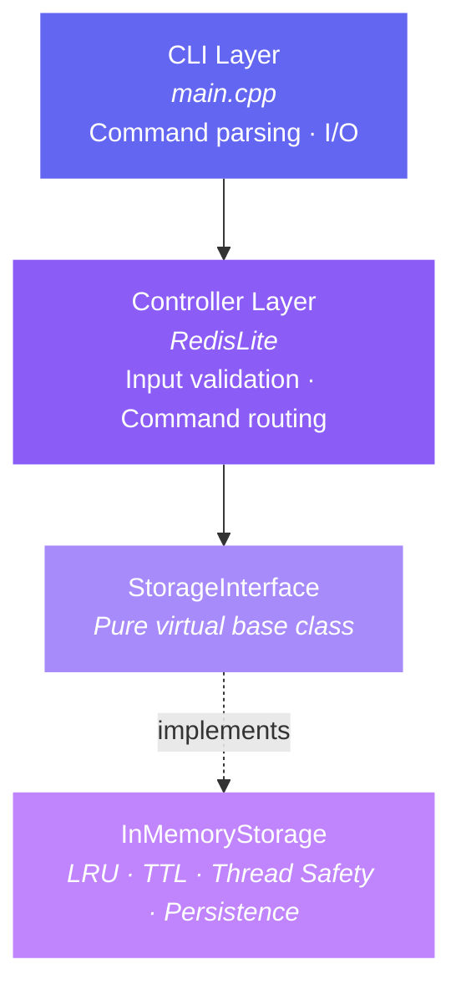
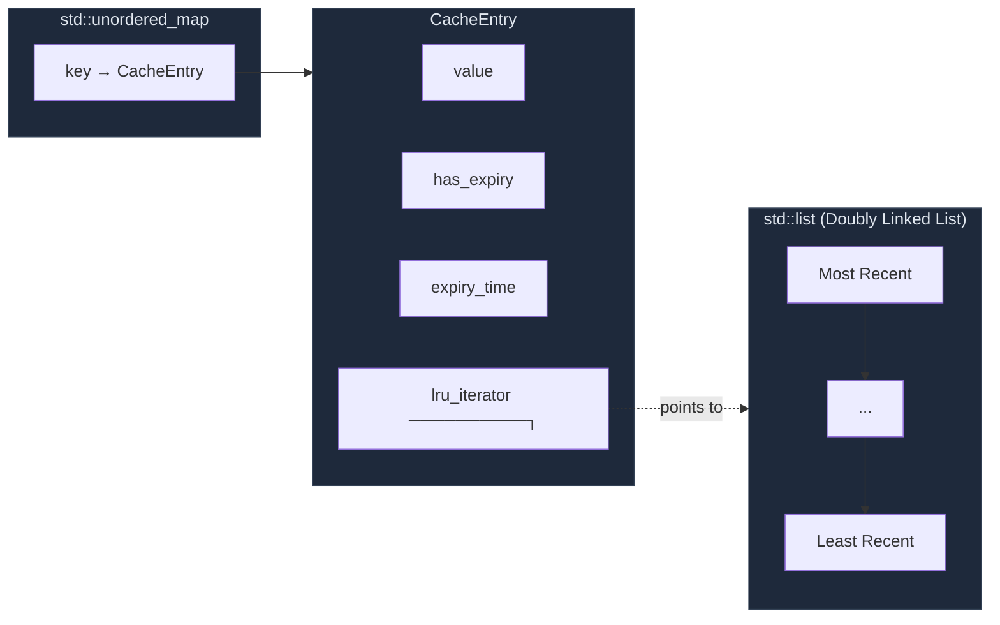
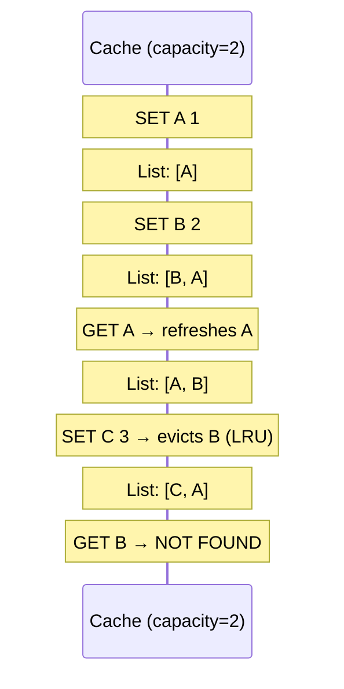
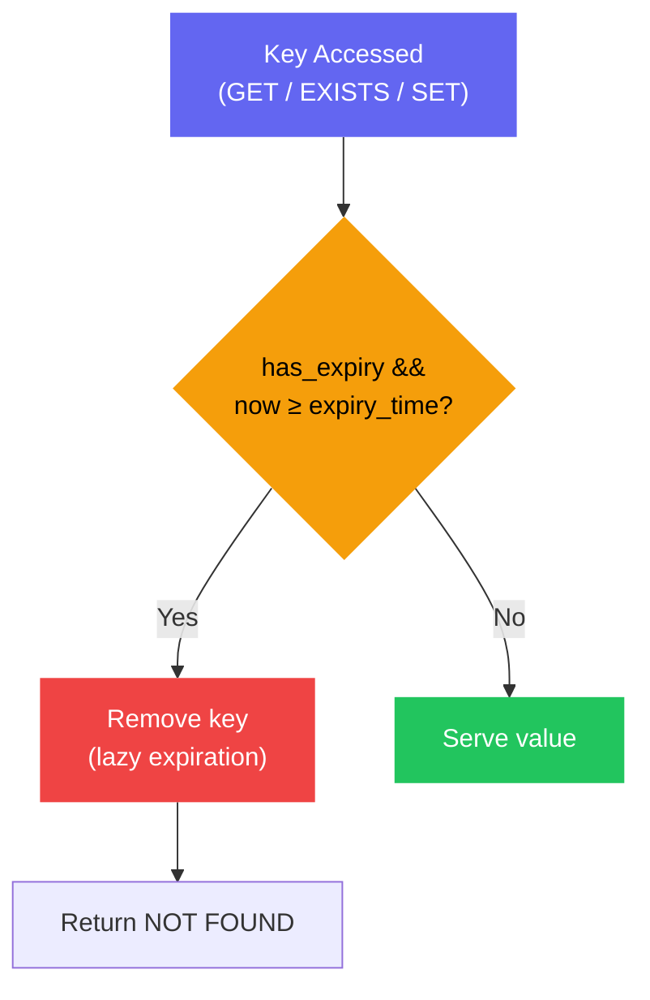

# Mini-Redis — Thread-Safe In-Memory Cache Engine (C++)

A Redis-inspired **in-memory key-value cache** built in **C++17**, featuring **O(1) LRU eviction**, **lazy TTL expiration**, **reader-writer thread safety**, and **snapshot persistence** — engineered to demonstrate systems-level understanding of how production caches work internally.

---

## Architecture


```mermaid
flowchart TD
    CLI["CLI Layer<br/><i>main.cpp</i><br/>Command parsing · I/O"]
    Controller["Controller Layer<br/><i>RedisLite</i><br/>Input validation · Command routing"]
    Interface["StorageInterface<br/><i>Pure virtual base class</i>"]
    Engine["InMemoryStorage<br/><i>LRU · TTL · Thread Safety · Persistence</i>"]

    CLI --> Controller
    Controller --> Interface
    Interface -.->|implements| Engine

    style CLI fill:#6366f1,color:#fff,stroke:none
    style Controller fill:#8b5cf6,color:#fff,stroke:none
    style Interface fill:#a78bfa,color:#fff,stroke:none
    style Engine fill:#c084fc,color:#fff,stroke:none
```

Each layer has a single responsibility:
- **CLI** handles only user interaction and parsing
- **Controller** validates inputs and delegates to storage
- **StorageInterface** defines the contract (enables polymorphism and testability)
- **Engine** owns all cache semantics — LRU, TTL, eviction, locking, persistence

---

## Core Data Structures


```mermaid
graph LR
    subgraph HashMap["std::unordered_map"]
        A["key → CacheEntry"]
    end

    subgraph DLL["std::list (Doubly Linked List)"]
        MRU["Most Recent"] --> N2["..."] --> LRU["Least Recent"]
    end

    subgraph Entry["CacheEntry"]
        V["value"]
        E["has_expiry"]
        T["expiry_time"]
        I["lru_iterator ──────────┐"]
    end

    A --> Entry
    I -.->|points to| DLL

    style HashMap fill:#1e293b,color:#e2e8f0,stroke:#334155
    style DLL fill:#1e293b,color:#e2e8f0,stroke:#334155
    style Entry fill:#1e293b,color:#e2e8f0,stroke:#334155
```

| Component | Data Structure | Purpose |
|-----------|---------------|---------|
| Key lookup | `unordered_map<string, CacheEntry>` | O(1) access by key |
| LRU ordering | `std::list<string>` | Doubly linked list maintains usage order |
| O(1) LRU updates | `list<string>::iterator` stored in CacheEntry | Constant-time splice/erase without traversal |

**Why this combination?** Hash map gives O(1) lookup. Doubly linked list allows O(1) insertion/removal at both ends. Storing the list iterator inside the map entry enables O(1) LRU position updates — no linear scan needed. This is the industry-standard LRU cache implementation (LeetCode #146).

---

## LRU Eviction

Most recently accessed keys are at the **front** of the list. Least recently used keys are at the **back**.


```mermaid
sequenceDiagram
    participant C as Cache (capacity=2)
    
    Note over C: SET A 1
    Note over C: List: [A]
    
    Note over C: SET B 2
    Note over C: List: [B, A]
    
    Note over C: GET A → refreshes A
    Note over C: List: [A, B]
    
    Note over C: SET C 3 → evicts B (LRU)
    Note over C: List: [C, A]
    
    Note over C: GET B → NOT FOUND
```

| Operation | LRU Effect |
|-----------|-----------|
| `GET` | Refreshes position (moves to front) |
| `SET` (existing key) | Refreshes position |
| `SET` (new key, at capacity) | Evicts LRU key from back |
| `EXISTS` | **Does not** affect LRU order |

All operations run in **O(1)** time.

---

## TTL (Time-To-Live)

TTL defines how long a key remains valid. Implemented using **lazy expiration** — expired keys are removed only when accessed, not by a background thread.


```mermaid
flowchart TD
    Access["Key Accessed<br/>(GET / EXISTS / SET)"]
    Check{"has_expiry &&<br/>now ≥ expiry_time?"}
    Remove["Remove key<br/>(lazy expiration)"]
    Return["Return NOT FOUND"]
    Serve["Serve value"]

    Access --> Check
    Check -->|Yes| Remove --> Return
    Check -->|No| Serve

    style Access fill:#6366f1,color:#fff,stroke:none
    style Check fill:#f59e0b,color:#000,stroke:none
    style Remove fill:#ef4444,color:#fff,stroke:none
    style Serve fill:#22c55e,color:#fff,stroke:none
```

**Key design decisions:**
- TTL is optional per key — set via `SETEX` or `EXPIRE`
- **Lazy expiration** keeps all operations O(1) and avoids background thread complexity
- **TTL eviction has priority over LRU eviction** — when capacity is full, expired keys at the back are swept before evicting a valid LRU key
- Expired keys are **not persisted** to disk — `SAVE` skips them

---

## Thread Safety

The cache is protected by a **`std::shared_mutex`** (reader-writer lock), allowing concurrent reads while ensuring exclusive writes.

| Method | Lock Type | Why |
|--------|-----------|-----|
| `GET`, `EXISTS` | `unique_lock` | Lazy expiration may remove keys (write operation) |
| `SET`, `DEL`, `EXPIRE` | `unique_lock` | Modifies data |
| `LOAD` | `unique_lock` | Clears and rebuilds entire state |
| `TTL` | `shared_lock` | Pure read — multiple threads can check TTL concurrently |
| `SAVE` | `shared_lock` | Snapshot is a read operation |

**Why `shared_mutex` over `mutex`?** A cache is read-heavy (many GETs, few SETs). A regular `mutex` blocks everyone — even concurrent readers. `shared_mutex` lets N readers proceed in parallel, only blocking when a writer needs access. This is the same pattern used in production database engines.

**Why not lock-free?** Lock-free structures (e.g., concurrent hash maps) offer higher throughput but add significant complexity. For a single-node cache, `shared_mutex` provides correctness with clean, auditable code. In a production system, the next step would be sharded locking — partitioning keys into N buckets with independent mutexes.

---

## Persistence (SAVE / LOAD)

| Command | Behavior |
|---------|----------|
| `SAVE filename` | Writes all **non-expired** keys to disk as `key=value` pairs |
| `LOAD filename` | Clears memory, loads keys from file, enforces capacity via LRU eviction |

**Design choices:**
- **Snapshot-based** — no write-ahead log (WAL) or append-only file (AOF)
- TTL metadata is **not persisted** — loaded keys are treated as non-expiring
- `LOAD` enforces capacity — if the file has more keys than `capacity_`, oldest entries are evicted
- Thread-safe — `SAVE` acquires a shared lock (readers can proceed), `LOAD` acquires an exclusive lock

---

## Commands

| Command | Syntax | Description |
|---------|--------|-------------|
| `SET` | `SET key value` | Set a key-value pair (no expiry) |
| `SETEX` | `SETEX key seconds value` | Set with TTL expiration |
| `GET` | `GET key` | Retrieve value (refreshes LRU) |
| `DEL` | `DEL key` | Delete a key |
| `EXISTS` | `EXISTS key` | Check if key exists (does not refresh LRU) |
| `EXPIRE` | `EXPIRE key seconds` | Set TTL on existing key |
| `TTL` | `TTL key` | Check remaining TTL (-1 = no expiry) |
| `SAVE` | `SAVE filename` | Persist to disk |
| `LOAD` | `LOAD filename` | Restore from disk |
| `EXIT` | `EXIT` | Quit |

---

## Complexity

| Operation | Time | Space |
|-----------|:----:|:-----:|
| SET | O(1) | O(1) |
| SETEX | O(1) | O(1) |
| GET | O(1) | O(1) |
| DEL | O(1) | O(1) |
| EXISTS | O(1) | O(1) |
| EXPIRE | O(1) | O(1) |
| TTL | O(1) | O(1) |
| SAVE | O(N) | O(N) |
| LOAD | O(N) | O(N) |

Overall space: **O(N)** where N = number of keys stored (bounded by capacity).

---

## Test Suite

### Unit Tests (22 tests)

```
========== Mini-Redis Test Suite ==========

[Basic Operations]
  test_set_and_get.................. PASSED
  test_get_nonexistent_key......... PASSED
  test_overwrite_existing_key...... PASSED
  test_delete_key.................. PASSED
  test_delete_nonexistent_key...... PASSED
  test_exists_found................ PASSED
  test_exists_not_found............ PASSED

[LRU Eviction]
  test_lru_eviction_basic.......... PASSED
  test_lru_refresh_with_get........ PASSED
  test_exists_does_not_refresh_lru. PASSED
  test_lru_capacity_one............ PASSED

[TTL Expiration]
  test_ttl_expiration.............. PASSED
  test_ttl_check_remaining......... PASSED
  test_ttl_no_expiry............... PASSED
  test_expire_existing_key......... PASSED
  test_exists_removes_expired_key.. PASSED

[TTL > LRU Priority]
  test_ttl_evicted_before_lru...... PASSED

[Persistence]
  test_save_and_load............... PASSED
  test_load_enforces_capacity...... PASSED
  test_save_skips_expired_keys..... PASSED
  test_load_nonexistent_file....... PASSED

[Controller Validation]
  test_controller_empty_key........ PASSED

Results: 22 passed, 0 failed
```

### Thread Safety Stress Tests (20,000 operations)

```
========== Thread Safety Stress Test ==========

  8 concurrent writers (4000 ops)........... PASSED
  8 mixed reader/writer threads............. PASSED
  8 threads doing mixed SET/GET/DEL......... PASSED
  8 threads with TTL operations............. PASSED
  8 threads fighting over same keys......... PASSED

Total operations: 20,000 across 40 threads
Errors: 0
Result: ALL PASSED
```

---

## Project Structure

```
mini-redis/
├── main.cpp                  # CLI — command parsing and I/O loop
├── RedisLite.h / .cpp        # Controller — input validation, command routing
├── StorageInterface.h        # Abstract interface (pure virtual)
├── InMemoryStorage.h / .cpp  # Engine — LRU, TTL, threading, persistence
├── Result.h                  # Result type with error codes and factory methods
├── CMakeLists.txt            # CMake build configuration (C++17)
├── .gitignore
└── tests/
    ├── test_main.cpp              # 22 unit tests (assert-based)
    └── test_thread_safety.cpp     # Concurrency stress tests (40 threads)
```

---

## Build & Run

**Prerequisites:** C++17 compiler (g++ 7+, clang 5+, MSVC 19.14+)

### Using g++ directly
```bash
# Build
g++ -std=c++17 main.cpp InMemoryStorage.cpp RedisLite.cpp -o mini_redis

# Run
./mini_redis

# Run unit tests
g++ -std=c++17 tests/test_main.cpp InMemoryStorage.cpp RedisLite.cpp -o run_tests
./run_tests

# Run thread safety tests
g++ -std=c++17 tests/test_thread_safety.cpp InMemoryStorage.cpp RedisLite.cpp -o run_thread_tests
./run_thread_tests
```

### Using CMake
```bash
mkdir build && cd build
cmake ..
cmake --build .

# Run
./mini_redis

# Run tests
ctest --output-on-failure
```

---

## Design Trade-offs

| Decision | Why |
|----------|-----|
| **`unordered_map` over `map`** | O(1) average lookup vs O(log n). Cache access must be fast — we don't need ordered traversal. |
| **Lazy TTL over active expiration** | No background threads. O(1) per access. Simpler correctness guarantees. Trade-off: expired keys consume memory until accessed. |
| **`shared_mutex` over single `mutex`** | Caches are read-heavy. Reader-writer locks allow concurrent GETs while serializing writes. |
| **`unique_lock` for GET/EXISTS** | Lazy expiration means reads can trigger writes (removing expired keys). Can't use `shared_lock` when mutation is possible. |
| **Snapshot persistence over WAL** | Simple and predictable. Trade-off: no durability between saves. Acceptable for a cache (data is ephemeral). |
| **TTL priority over LRU** | Expired keys are "dead weight." Evicting them first preserves valid cache entries and improves hit rates. |
| **`assert`-based tests over Google Test** | Zero external dependencies. Project is small enough that simple assertions provide full coverage without framework overhead. |

---

## Limitations & Future Scope

- No networking (TCP/RESP protocol)
- No background TTL cleanup (relies on lazy expiration)
- Single-node only (no replication or sharding)
- Persistence format doesn't support keys containing `=`

These are intentional scoping decisions to keep focus on **cache internals and correctness**.

---

<div align="center">

**Made by [Madhav Thesiya](https://www.linkedin.com/in/madhavthesiya/)** — If this was useful, drop a ⭐

</div>
